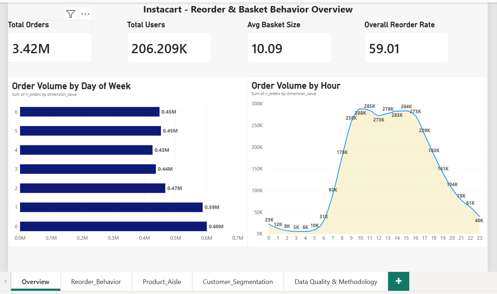
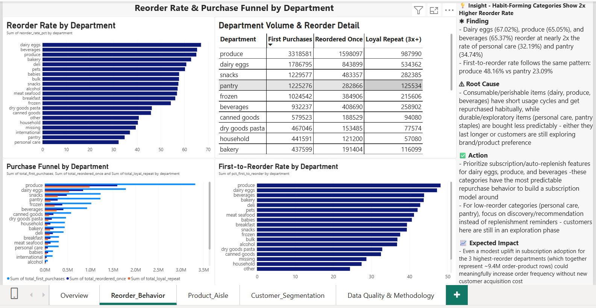
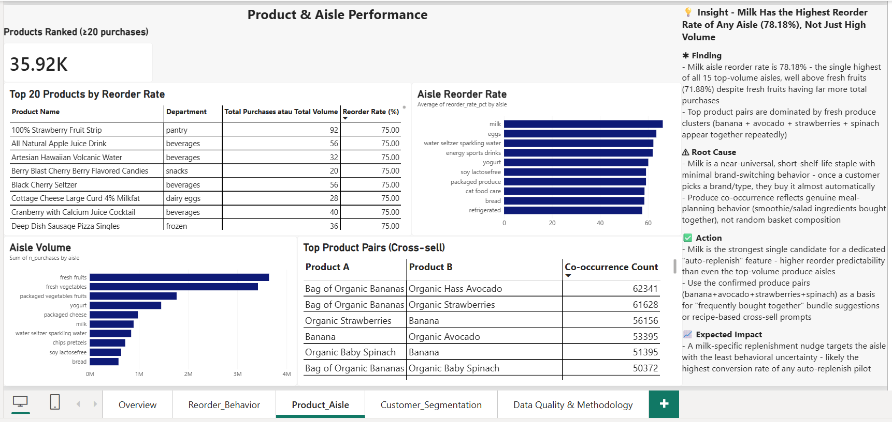
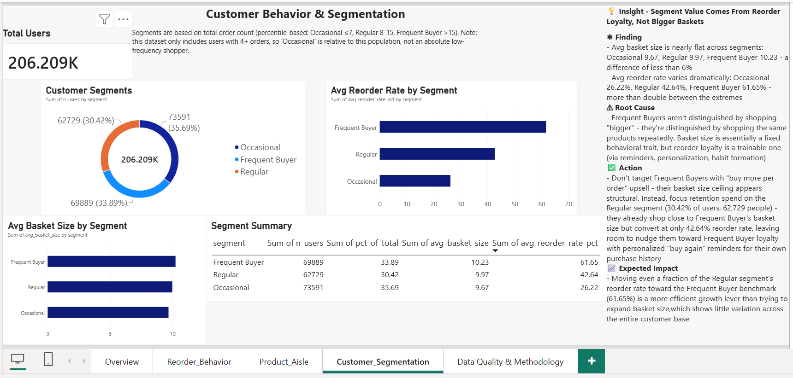
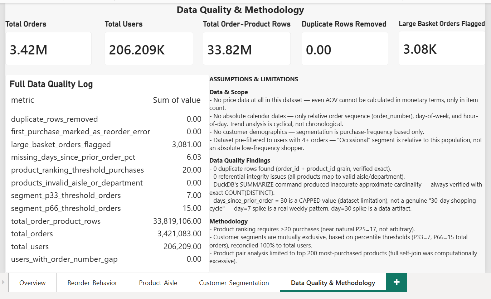

# Instacart Market Basket Analysis — Data Analyst Portfolio Project

> Stack: DuckDB · SQL · Power BI · Git/GitHub
> Status: ✅ Complete (Business Understanding → Dashboard → Insights)

## Tentang Project Ini
Analisis pola reorder, komposisi basket, dan segmentasi customer menggunakan **Instacart
Market Basket Analysis Dataset** (Kaggle). Fokus ke behavior/analytics — bukan ML
modeling/prediksi (itu roadmap Data Scientist terpisah, ditunda).

Dataset ini punya keterbatasan lebih besar dari project sejenis (Retail Rocket): **tidak ada
data harga sama sekali** (bahkan AOV dalam nilai uang tidak bisa dihitung), tidak ada tanggal
kalender absolut (cuma waktu relatif: hari-dalam-minggu, jam-dalam-hari, urutan order), dan
tidak ada demografi customer. Detail lengkap di [`docs/assumptions.md`](docs/assumptions.md).

Metodologi kerja mengadaptasi pola yang sudah terbukti dari project Retail Rocket:
skeleton-first, mart kecil + parquet per milestone, git checkpoint di tiap tahap, dan pola
kerja iteratif (investigasi → keputusan → revisi → dokumentasi → commit) — lihat
[`docs/roadmap.md`](docs/roadmap.md) untuk detail adaptasinya.

## Struktur Folder
```
instacart_project/
├── data/
│   ├── raw/              # 6 CSV asli — source of truth, tidak di-push ke git
│   └── processed/        # Output antar-milestone (.parquet)
├── data_mart/             # 8 mart final untuk dashboard (.parquet)
├── sql/                   # Query per milestone (02-10)
├── dashboard/             # File Power BI (.pbix)
├── screenshots/           # Screenshot tiap halaman dashboard
├── docs/
│   ├── roadmap.md         # Roadmap 15 tahap + adaptasi dari Retail Rocket
│   ├── assumptions.md     # Semua keputusan & temuan metodologi
│   └── insights.md        # Insight & business recommendation
└── instacart.duckdb       # Database lokal (di-.gitignore)
```

## Cara Reproduce
1. Download dataset dari Kaggle (Instacart Market Basket Analysis), taruh 6 CSV di `data/raw/`
   (`orders.csv`, `order_products__prior.csv`, `order_products__train.csv`, `products.csv`,
   `aisles.csv`, `departments.csv`)
2. Download DuckDB CLI dari duckdb.org, taruh `duckdb.exe` di root project
3. Jalankan milestone berurutan:
   ```powershell
   .\duckdb.exe instacart.duckdb
   ```
   ```sql
   .read sql/02_data_collection.sql
   .read sql/04_cleaning.sql
   .read sql/06_data_modeling.sql
   .read sql/07_eda.sql
   .read sql/08_reorder_behavior.sql
   .read sql/09_customer_segmentation.sql
   .read sql/10_data_mart.sql
   ```
4. Buka `dashboard/instacart_analytics.pbix` di Power BI Desktop — data ter-refresh dari
   parquet di `data_mart/`

## Dashboard — 5 Halaman

### 1. Overview
KPI cards (Total Orders, Users, Basket Size, Reorder Rate), pola order per hari-minggu & jam.



### 2. Reorder & Behavior
Reorder rate per department, purchase funnel (first→reorder→loyal repeat).



### 3. Product & Aisle Performance
Top produk by reorder rate, performa aisle, top product pairs (cross-sell).



### 4. Customer Behavior & Segmentation
Segmentasi Occasional/Regular/Frequent Buyer (persentil-based), basket size & reorder rate per segmen.



### 5. Data Quality & Methodology
Metrik kuantitatif data quality + assumptions/limitations sebagai teks statis.



## Insight & Recommendation
3 insight utama (kategori habit-forming vs eksploratif, aisle milk sebagai kandidat
subscription terkuat, loyalitas sebagai pembeda segmen customer) dengan struktur
Finding → Root Cause → Action → Expected Impact — lihat [`docs/insights.md`](docs/insights.md).

## Key Methodology Decisions
- **Cardinality**: DuckDB's `SUMMARIZE` terbukti meleset signifikan (aisles 131 vs exact 134,
  departments 19 vs exact 21) — semua cardinality project wajib pakai `COUNT(DISTINCT ...)` exact
- **`days_since_prior_order` = 30 adalah capped value**, bukan pola alami — dikonfirmasi lewat
  perbandingan tren hari 25-29 (gradual) vs lonjakan tajam di hari 30 (14-19x lipat)
- **Large basket orders (>50 item, 0.1% dari total) tetap di-retain**, cuma diberi flag — beda
  keputusan dari bot filtering Retail Rocket karena di sini tidak ada bukti distorsi
- **Product ranking threshold**: minimum 20 pembelian, mendekati P25 natural (17), bukan
  angka sembarang
- **Customer segmentation**: mutually exclusive berdasarkan persentil (P33=7, P66=15 total
  order), tervalidasi reconcile 100% ke total unique user
- **Product pair analysis** dibatasi ke top 200 produk terpopuler — full self-join ke 33.8 juta
  baris terbukti computationally excessive (estimasi >1 jam), dioptimasi jadi hitungan detik

Detail lengkap semua keputusan ada di [`docs/assumptions.md`](docs/assumptions.md).

## Roadmap
Lihat [`docs/roadmap.md`](docs/roadmap.md) untuk roadmap lengkap 15 tahap, termasuk tabel
"Ringkasan Adaptasi" yang menjelaskan apa yang di-drop/diganti dari template Retail Rocket
dan alasannya (mis. EAV-to-Wide dihapus karena Instacart sudah relational, Funnel Analysis
diganti Reorder & Behavior Analysis karena tidak ada event funnel di dataset ini).
